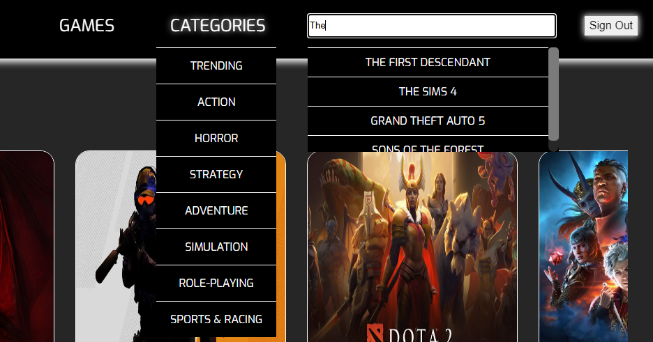

# 🎮 XP EXCHANGE


## 🚀 Purpose of the Project  
The website is designed to cater to a general audience with an interest in gaming. Its primary goal is to provide a space where users can engage with others by seeking advice or offering tips on games they are currently playing. While similar to Reddit in its functionality, this platform will focus exclusively on gaming content, making it a go-to resource for gamers looking to connect, seek advice, or offer guidance on a wide variety of games. This specialized focus fosters a more targeted, community-driven environment, promoting both learning and engagement within the gaming community.


- **Audience**: Our target audience includes anyone who loves games or is interested in gaming, from casual players exploring new titles to dedicated enthusiasts sharing strategies. 

The platform welcomes individuals of all skill levels and fosters a community for those passionate about engaging with gaming content.

---


## ✨ Main Features  
- 🎮 **Create, Modify, Delete Posts**: Users can manage their posts.
  
  
  
- 🎨 **Post Replies**: Users can engage with each other's content.


- 🚀 **User Star Rating**: Users can rate posts using a star system.


- 🔍 **Game Search & Filters**: Users can search for games or browse by categories.  




- 📝 **Create Account**: Users can create an account to personalize their experience.
  
  


  - 📱 **Responsive Design**: Works seamlessly on desktop, tablet, and mobile devices.  

---

## Visual Updates:
- Logo Resizing: Adjusted for better visibility.
- CSS Fixes: Various updates to improve visual consistency.

---

## Team Members

| Name             | Role                  | Contribution                                           |
|------------------|-----------------------|-------------------------------------------------------|
| Anupa            | Frontend Developer    | Works on the structure, layout, and styling of the website using HTML and CSS. |
| Joseph Nahas     | JavaScript Developer  | Implements the interactive and functional aspects of the site. |
| Jenny            | Team Lead             | Manages the GitHub repository, sets up issues, and oversees progress on the Project Board. |
| Alaa Attia       | Design Specialist     | Focuses on the site’s visual aesthetics, user experience, and accessibility. |

## GitHub Links
- [Live Link to the Website](https://jneyugn.github.io/game-website/)
- [Project Board](https://github.com/users/Jneyugn/projects/3)
- [Branch Workflow](https://github.com/Jneyugn/game-website/branches)
- [Commit History](https://github.com/Jneyugn/game-website/commits/main/)

  ---
  
## Video Overview
Watch this [video](https://www.youtube.com/watch?v=rHYCLV1E5J0) for an overview of the project.

## 💻 Installation Instructions
Before installing XP Exchange you need:
- Git
- Node.js >= 14.x 

1. **Clone the repository**:
   Run the following command in your terminal to clone the repository to your local machine:
   ```bash
   git clone https://github.com/your-username/game-website.git

